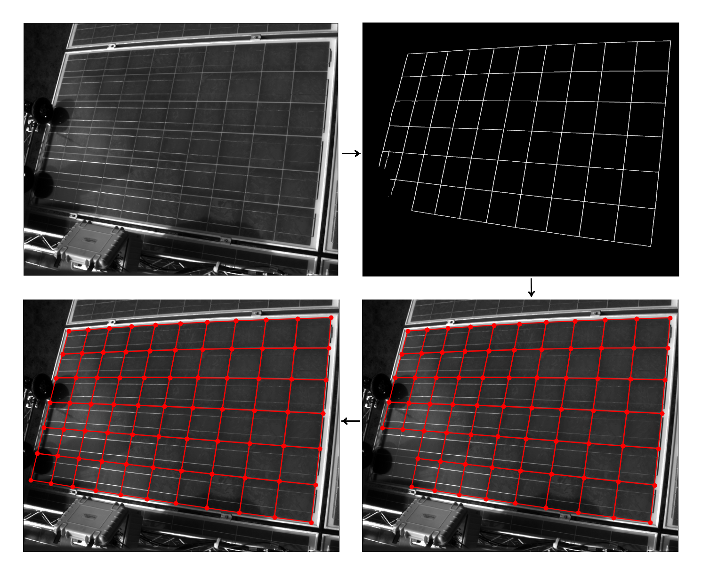
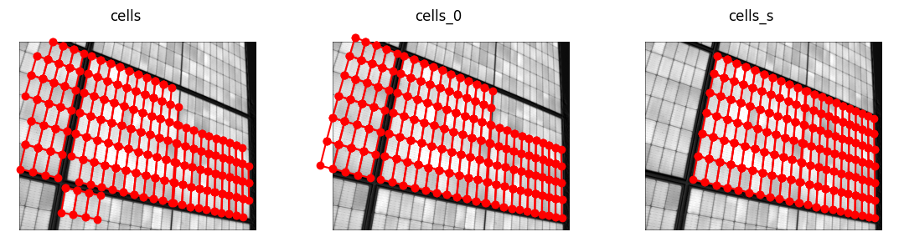
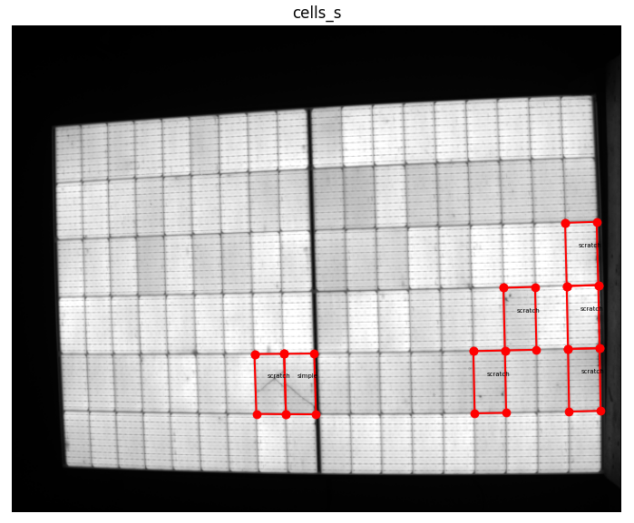
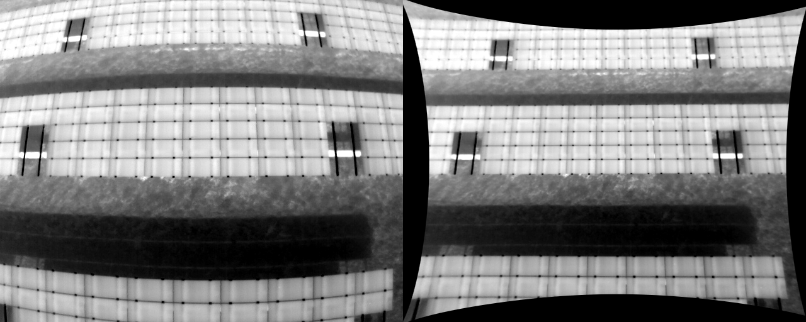

# Compute PV module cells coordinates in EL images

The repository consists of several tools that allow the identification of PV cells in EL images. Current repository is just a description of package capabilities.

The following diagram depicts the approach's main idea. In the first step, an image-to-image translation (hence, `imgtr`) neural network translates a given image to a binary grid image. The detected grid is analyzed in the second step, and failures are filtered. Lastly, any missing cells are completed by assuming the module has a rectangular structure and, optional, symmetry in submodules. The identified cell coordinates are stored in image metadata.



The repository comes with several pre-trained models. To list available models, say

```
imgtr_cells --list_models
Available models:
    HD_SZS9
    ...
```

New models can be trained with new labeled data. See training a [new model instructions](docs/training.md).

## Acknowledgements

This work is supported by the "PARK3" (Förderkennzeichen: 03EE1104), "ReliaREN-Pro" (Förderkennzeichen: 03EI4052B), and "PV-Scan" (Förderkennzeichen: 0325588B) projects, and by Solarzentrum Stuttgart GmbH and Kiwa PI Berlin AG companies by providing the data.

## `imgtr_cells`: generate grid and compute cell coordinates

Basic example: provide a bunch of images, and output is saved as PNG in the `cells` directory (`-o` default argument value):

```
find ... | imgtr_cells -m HD_SZS9 --gpu 0
```

The `imgtr_cells` script accepts a list of filename paths in the `-i` argument, with default value `-` making `imgtr_cells` read input path names from the standard input. The script output is the PNG (by default) images (placed in the cells directory) with [EXIF metadata](docs/metadata.md) containing a dictionary with cell coordinates. Furthermore, `imgtr_cells` prints to the standard output paths of the output images.

The script uses image-to-image translation models downloaded to the `~/.imgtr_models` directory. The `imgtr` generates a binary grid image with those models. The corner coordinates are computed from a binary grid by finding intersections of lines. The resulting dual graph faces are filtered for outliers, using face properties such as area, minimum parallelogram side ratio, area ratio with parallelogram, and perimeter.

The `--gpu` parameters can be used to select a graphic card or set to `--gpu=-1` to perform computations on the CPU only.

The `-k` argument (default: `cells`) specifies the dictionary's key written to the metadata.

## `imgtr_complete_cells`: complete missing cells

Basic example:

```
find ... | imgtr_complete_cells
```

Complete missing cells, assuming each component has a regular and rectangular cell structure. `imgtr_complete_cells` estimates the camera position from the identified cell coordinates, and reconstruction error is computed. If the assumption that the discovered cells are not the same size is not fulfilled, then the reconstruction error will be significant. In particular, if the reconstruction error is larger than `-E` (default 1), the `imgtr_complete_cells` prints an error message for the considered image. The argument `-E` might depend on the original image resolution.

The `-d` argument controls the camera model being used. `-d no_camera` switches of camera distortion model, and a pinhole camera model is assumed. See more options in `imgtr_complete_cells --help`.

An image may contain more than one component (e.g., for half-cell modules). `imgtr_complete_cells` ignores any component with fewer cells than the `--min_component` argument (default 20).

Similar to `imgtr_cells`, by default, `imgtr_complete_cells` expects image paths in standard input and prints processed image paths in the standard output.

The `-k` argument (default: `cells`) specifies the key of the metadata dictionary to use as input, and `-o` (default: `cells_0`) is the dictionary key for the output.

## `imgtr_plotcells`: plot image with pyplot

Use `imgtr_plotcells` to plot the images with cell coordinates. Read more about how the data is stored [here](docs/metadata.md).

A basic example of interactive plots with matplotlib:

```
find ... | imgtr_plotcells -k cells,cells_0,cells_s
```


The script reads cell data in the EXIF data and plots them. Here is an example



Use `-l` argument to plot defect labels

```
find ... | imgtr_plotcells -k cells_s -l labels_szs -n
```

where the `-n` flag skips images without the cell's data.



`imgtr_plotcells` can also be used to do surveys with `-c` option, for example

```
find ... | imgtr_plotcells -c 'z:okay,1:label1,2:label2' > survey.csv
```

A user may press a corresponding key to label an image and press `q` to proceed to the following image. If any keys corresponding to the label were pressed, then the `<filename>,<pressed_label>` is printed in standard output. When several labels are selected for a single image, only the last one will be printed. Such labeling logging can be used to evaluate the model (see more info in the [the training a model guide](docs/training.md)).

## `imgtr_rd`: estimate camera distortion from several images

From the cell data, one can estimate the camera distortion:

```
find ... | grep __camera_id | imgtr_rd -E 0.5 -o camera_id.json
```

where an input image is ignored, the reconstruction error for distortion estimated from that image is more than 0.5 (`-E` argument).

The camera data has the following format:

```
{
  "mtx": [
    [ 895.5588706012711, 0.0,               294.004167606456   ],
    [ 0.0,               951.1110690100385, 256.72789006337473 ],
    [ 0.0,               0.0,               1.0
    ]
  ],
  "dist": [[ -0.3754628106689596, 0.6365673950696666, 0.0013193451404657113, 0.0027343797861103694, -1.3404116456519595 ]]
}
```

and the JSON file can be used as input to `imgtr.radialdistortion.RadialDistortion.fromjson`.

The camera distortion can be corrected with `imgtr_rd_apply` script

```
find ... | imgtr_rd_apply -o <output_dir> -i camera_id.json
```

The `imgtr_rd` script may be useful for situations, when traditional methods in camera distortion estimation is difficult, for example in IR dr
one inspections.



## `imgtr_metadata` handle EXIF metadata for

The `imgtr_metadata` provide several tools allowing to import/export, filter and compute various statistics on it. See more details [here](docs/imgtr_metadata.md). For example, the following query computes the size of EXIF metadata (keeping in mind 64kB is the limit).

```
find ... | imgtr_metadata hist -e "size(_)" -t hist_bin
100%|███████████...██| 31073/31073 [00:04<00:00, 6346.32it/s]
    [   8 k,   16 k): 561
    [   4 k,    8 k): 30506
    [   2 k,    4 k): 1
    [ 512  , 1024  ): 3
    [ 256  ,  512  ): 1
```

## `imgtr_cutout`: cut out individual cells

The `imgtr_cutout` also allows organizing cell images into subdirectories according to the label, for example:

```
find ... | imgtr_cutout \
                --basename \
                --nonempty_unlabelled \
                -l labels_szs \
                -w 'branching,busbar,dark cell,isolating,object,other,scratch,simple' \
                -b 'duplicate,quality'
```

where only cells with labels from the allowlist (`-w` argument) will be saved, and cells with labels from the blocklist (`-b` argument) will be ignored. Cells without any label will be saved as `unlabeled`. Flags `--nonempty_unlabelled` makes cells with non-empty labels be saved as `unlabeled` if they contain nothing from the allowlists or blocklists.

## Publications

E. Sovetkin, B. E. Pieters, A. Gerber, L. Stoicescu and P. Koelblin, "Fast Cell Detection and Distortion Correction for Outdoor Electroluminescence Images," 2023 IEEE 50th Photovoltaic Specialists Conference (PVSC), San Juan, PR, USA, 2023, pp. 1-6, doi: [10.1109/PVSC48320.2023.10359780](https://doi.org/10.1109/PVSC48320.2023.10359780)

E. Sovetkin, A. Gerber, L. Stoicescu, P. Koelblin and B. E. Pieters, "Using high-resolution generative models for PV cells and module extraction: large-scale evaluation", 2025, draft
