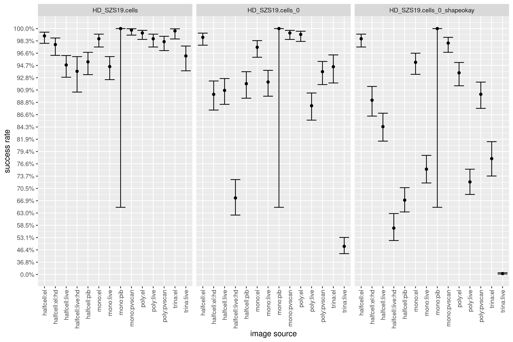
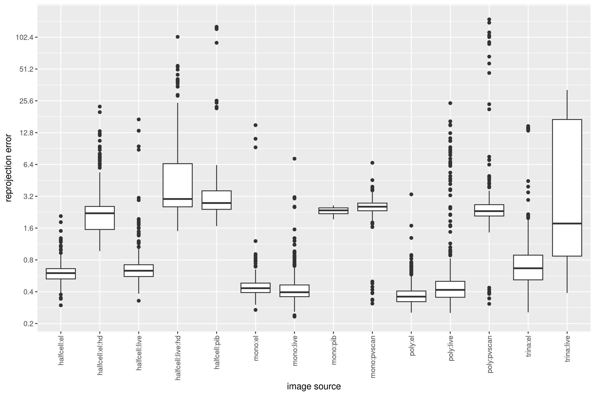

# Evaluation

A complete model evaluation is not possible, as we don't have ground truth. However, it is possible to at least check the rate at which different parts program fail, and check the final shape of the module.

For model evaluations we define images type, expected shape and matching path regular expression in the following csv file:

```
% cat sample4benchmark.csv
type,regex,shape
halfcell:el,(?!.*_live.*$).*20230731,6-9@6-9
halfcell:live,.*20230731.*_live,6-9@6-9
...
poly:el,(?!.*_live.*$).*MCLB,6-12
poly:live,.*MCLB.*_live,6-12
poly:el,(?!.*_live.*$).*20220520,6-10
poly:live,.*20220520.*_live,6-10
...
trina:el,(?!.*_live.*$).*20230705,2-12@3-12@2-12@3-12
trina:live,.*20230705.*_live,2-12@3-12@2-12@3-12
...
```

That CSV file is used to generate a directory with PNG images, on which multiple models are run. The [sample4benchmark.py](sample4benchmark.py) script sample random images from directory (see `N` variable).

The `sample4benchmark.py` is designed to fail, if there are some images exists in the source directory, that don't match any of the regular expression, or if there are multiple expressions that match a single file. So, good luck writing those regexes...

With the `sample_benchmark` directory generated, the following script can be used to run multiple models. Note, that at some point exif metadata will fail to be saved, if there are too many models evaluated.

```
DNAME="sample_benchmark"

MODELS=()
MODELS+=("HD_SZS16")
MODELS+=("HD_SZS17")
MODELS+=("HD_SZS18")
MODELS+=("HD_SZS19_3")
MODELS+=("HD_SZS19_6")
MODELS+=("HD_SZS19_9")
MODELS+=("HD_SZS19")

HDIMG_rex='pvscan|pib|20240920|20241115'

find "${DNAME}" -type f -name '*.png' | shuf > "${DNAME}.list"

for model in "${MODELS[@]}"
do
    imgtr_cells -i "${DNAME}.list" -s -o "." \
                -m "${model}" \
                -k "${model}/cells" \
                --gpu 0 -b 64

    # high-resolution images
    rg "${HDIMG_rex}" "${DNAME}.list" | \
        imgtr_complete_cells -k "${model}/cells" -o "${model}/cells_0" -E 5

    # low-resolution images
    rg -v "${HDIMG_rex}" "${DNAME}.list" | \
        imgtr_complete_cells -k "${model}/cells" -o "${model}/cells_0" -E 1
done
```

In order to analyse results the [benchmark.py](benchmark.py) script reads images EXIF metadata from the `sample_benchmark` directory, and generates a single CSV files out: `benchmark.csv.gz`, that has the following format:

```
fn,type,HD_SZS19/cells,HD_SZS19/cells_shapeokay,HD_SZS19/cells_extra,HD_SZS19/cells_0,HD_SZS19/cells_0_shapeokay,HD_SZS19/cells_0_extra,HD_SZS19/cells_0_rmse
sample_benchmark/...<filename>.png,mono:pib,1,1,0,1,1,0,2.618575418045395
sample_benchmark/...<filename>.png,mono:pib,1,1,0,1,1,0,1.93857628621332
sample_benchmark/...<filename>.png,mono:pib,1,1,0,1,1,0,2.1894247313102895
```

Apart from `fn` and `type`, the following columns are present for each
evaluated model:

 - `<model>/cells` (0 or 1) indicates if `imgtr_cells` completed without error
 - `<model>/cells_0` (0 or 1) indicates if `imgtr_complete_cells` completed without error
 - `<model/cells_0_rmse>` (float) reconstruction error reported by `imgtr_complete_cells`
 - `<model>/cells_shapeokay` (0 or 1) shape was detected correctly, based on `imgtr_cells` output
 - `<model>/cells_0_shapeokay` (0 or 1) shape was detected correctly, based on `imgtr_complete_cells` output
 - `<model>/..._extra` (integer) number of non-matching components

The R-script [benchmark.R](benchmark.R), produces some of the plots from the `benchmark.csv.gz`, shown below:





Categorisation of why some model fails requires manual surveying of specific image categories. For that I use `imgtr_plotcells` tool, that allows look through images, and set a specific category to each of them:

```
shuf -n1000 <filenames> | \
    imgtr_plotcells -c 'z:okay,1:low_contrast,2:live_noisy' \
    > survey.log
```
