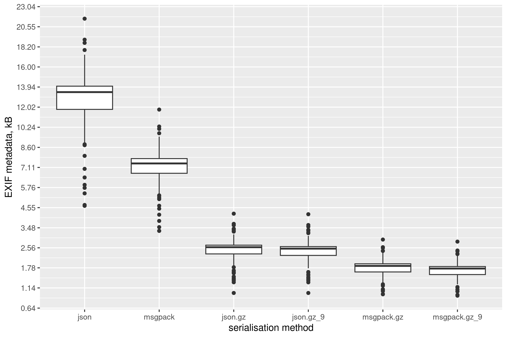

# EXIF metadata

The cell coordinates and defect labels are stored in EXIF's User Comment (field `0x9286`) metadata. The json-serialisable dictionary in python is stored as a compressed msgpack binary data. The PNG and JPEG EXIF data is limited to 64kB.

To extend the metadata storage to other format, one must extend `load_exif` and `dump_exif` functions in imgtr/exitdata.py.

## Examples

The data to be stored must be json-serialisable python dictionary. The following example shows loading cell coordinates data from the images.

```
% from imgtr.exifdata import load_exif
% FN = 'image.png'
% data = load_exif(FN)
% data.keys()
dict_keys(['cells', 'cells_0'])
% data['cells'].keys()
dict_keys(['0_1,1', '0_1,2', '0_0,3', '0_0,4', '0_1,3', '0_0,5', '0_1,4', '0_2,0', '0_0,6', '0_1,5', '0_2,1', '0_0,7', '0_1,6', '0_2,2', '0_1,7', '0_2,3', '0_1,8', '0_0,9', '0_0,10', '0_1,9', '0_2,5', '0_3,0', '0_2,6', '0_3,1', '0_2,7', '0_2,8', '0_3,2', '0_1,10', '0_2,9', '0_3,3', '0_2,10', '0_3,4', '0_3,5', '0_3,6', '0_3,7', '0_3,8', '0_4,0', '0_3,9', '0_4,1', '0_3,10', '0_4,2', '0_4,3', '0_4,4', '0_4,5', '0_4,6', '0_4,7', '0_4,8', '0_4,9', '0_4,10', '0_5,0', '0_5,1', '0_5,2', '0_5,3', '0_5,4', '0_5,5', '0_5,6', '0_5,7', '0_5,8', '0_5,9', '0_5,10'])
```

The cells are stored in `cells` (output of `imgtr_cells`) and `cells_0` (output of `imgtr_complete_cells`), which are dictionary keys by the name of the cell. The name has the following format: `<component>_<row>,<column>`. The coordinates are stored as a list of four pixel coordinates.

```
% data['cells']['0_1,1']
[[122.125, 200.625],
 [191.4166717529297, 203.22915649414062],
 [202.625, 259.53125],
 [135.875, 255.46875]]
```

New data can be added by using `dump_exif`, which essentially works by updating the existing dictionary.

```
% from imgtr.exifdata import dump_exif
% dump_exif(FN, {'defects': {'0_5,10': ['crack']}})
% data = load_exif(FN)
% data.keys()
dict_keys(['cells', 'cells_0', 'defects'])
```

One can delete existing data by calling `delkey_exif`

```
% from imgtr.exifdata import delkey_exif
% delkey_exif(FN, 'defects')
% data = load_exif(FN)
% data.keys()
dict_keys(['cells', 'cells_0'])
```

When using exif operations, it is important to wrap them in the context manager, as otherwise any interruption in the process may lead to data corruption. This should be kept in mind for implementing metadata for other file formats.

## Compression statistics

The compressed msgpack serialisation was chosen due to this:



where size of compression was tested with `json`, `msgpack`, and different compression levels. The following script reads a list of images and creates a table with a distribution of stored objects size.

```
#!/usr/bin/env python3

import json
import msgpack
import pandas as pd
import sys
import tqdm
import zlib

from imgtr.exifdata import load_exif

if __name__ == '__main__':

    with sys.stdin as f:
        fns = [x.strip() for x in f.readlines()]

    res = []
    for fn in tqdm.tqdm(fns):
        try:
            data = load_exif(fn)

            res.append({
                'fn': fn,
                'nkeys': len(data),
                'json': len(json.dumps(data)),
                'msgpack': len(msgpack.dumps(data)),
                'json.gz': len(zlib.compress(json.dumps(data).encode())),
                'json.gz_9': len(zlib.compress(json.dumps(data).encode(), level=9)),
                'msgpack.gz': len(zlib.compress(msgpack.dumps(data))),
                'msgpack.gz_9': len(zlib.compress(msgpack.dumps(data), level=9)),
            })
        except Exception as e:
            print(f'Error: {e}', file=sys.stderr)
            continue

    pd.DataFrame(res).to_csv('exif_stats.csv.gz', index=None)
```

The following R script creates the plot.

```
df <- read.csv('exif_stats.csv.gz')

require(ggplot2)

df[,c(-1,-2)] <- df[,c(-1,-2)]/df[,"nkeys"]
d <- reshape::melt(df[,c(-1,-2)])
d$value <- d$value * 0.001

png("exif_comp.png", width=2400, height=1600, res=300)
ggplot(d, aes(x=variable, y=value)) + geom_boxplot() +
    scale_y_continuous(breaks = round(seq(0, 8, length.out=31)^2,2), transform="sqrt") +
    xlab("serialisation method") + ylab("EXIF metadata, kB")
dev.off()
```
