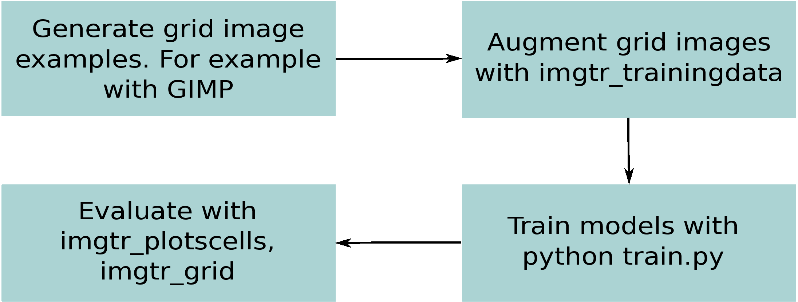

# Training new models



## Manual label creation with GIMP

1. Save image as png in a higher resolution `(2048,2048)`, e.g. with [raw2png.py](docs/raw2png.py) script.
2. Open original image in GIMP.
3. Press: `Ctrl+Shift+n`: to create a new layer.
4. Press: `p` to select a brush. Set brush settings to 1 pixel (precise value is not important, as masks is thinned in `imgtr_trainingdata`).
5. In the new layer, paint grid.
6. Select the image layer (`Ctrl+l, PgDw`) and mark it invisible.
7. Press: `Ctrl+Shift+e` to export the grid layer to a png file. Place the file in a separate directory from the image directory. The saved image must have the same name as the original image.

## `imgtr_imggrid2cells` (optionally) for shuffling

The `imgtr_imggrid2cells` looks for pairs of images and grids and generates cell corners metadata that is used for cell shuffling.

```
./imgtr_imggrid2cells -i pix2pixHD/datasets/pi_data/imgs_4 \
                      -g pix2pixHD/datasets/pi_data/mask_4
```

## `imgtr_trainingdata` generate training data

The `imgtr_trainingdata` finds pairs of images, augments them and saves the training dataset in a directory.

```
imgtr_trainingdata --path_a imgs \
                   --path_b grid \
                   --odir <output_dir> \
                   --a_N 300 \
                   --a_sigmas 0,5,1 \
                   --resize 650,650
```

For each image generate random augmentations `--a_N`. Images are resized to specified dimensions (e.g. `--resize="2048,2048"`). And written to `--odir` directory.

`--separate_dirs="train"` for Pix2PixHD directory structure


Augmentations:
 - shifts (`--a_shifts`)
 - perspective (`--a_prsp`)
 - contrast (`--a_cntrst`)
 - symmetry flips (`--a_symmetry`)
 - add noise (`--a_sigmas`)
 - shuffle cells (`--shuffle_prob`)

Images are resized: `-resize="2048,2048"` size of the generated images.


Use `--help` to discover augmentation options.

`--match='.*/([^/]*)/([^/]*)$'` match argument maybe used to match images with masks.


`--a_N=150` number of images generated

`--shuffle_prob=0` no shuffling, `--shuffle_prob=0.5` 50% of all images have shuffled cells.


Example: `--a_prsp='-0.2,0.005,0.005'` distortion varies between ...

## Train a model with `train.py`

Place dataset with the name under `datasets`.

type of encoder used for generator

epochs
numD
NGF
feat_num

### Pix2PixHD

```
#!/bin/bash

set -xeu

[ -z "${NAME}" ] && NAME=HD_SZS20
[ -z "${EPOCHS}" ] && EPOCHS=10
[ -z "${GLOBAL}" ] && GLOBAL=1024
[ -z "${LOCAL}" ] && LOCAL=2048
[ -z "${NUM_D}" ] && NUM_D=4
[ -z "${NGF}" ] && NGF=32

DATASET="datasets/${NAME}"

python train.py \
       --name "${NAME}_global" \
       --netG "global" \
       --dataroot "${DATASET}" \
       --fineSize "${GLOBAL}" \
       --loadSize "${GLOBAL}" \
       --label_nc 0 \
       --nThreads 6 \
       --niter $((EPOCHS/2)) \
       --niter_decay $((EPOCHS/2)) \
       --save_epoch_freq 2 \
       --no_instance

python train.py \
       --load_pretrain "./checkpoints/${NAME}_global" \
       --name "${NAME}" \
       --netG "local" \
       --num_D "${NUM_D}" \
       --dataroot "${DATASET}" \
       --fineSize "${LOCAL}" \
       --loadSize "${LOCAL}" \
       --label_nc 0 \
       --nThreads 6 \
       --ngf "${NGF}" \
       --niter $((EPOCHS/2)) \
       --niter_decay $((EPOCHS/2)) \
       --niter_fix_global $((EPOCHS/2)) \
       --save_epoch_freq 2 \
       --no_instance
```


## Pack model with `imgtr_packmodel`

The available models are listed in `imgtr/models_download.py`, and downloaded on the fly by `imgtr_cells`, and unpacked in `~/.imgtr_models`.

```
...
MODELS = {
    'HD_SZS16':    '<url>',
}
```

Additional models can be unpacked manually `~/.imgtr_models`.

# Model evaluation

Currently, there are not a lot of tools available within the package
to do model evaluations automatically.

`imgtr_grid` can be used to manually generate grid images.

See more in [evaluation page](evaluation.md).
